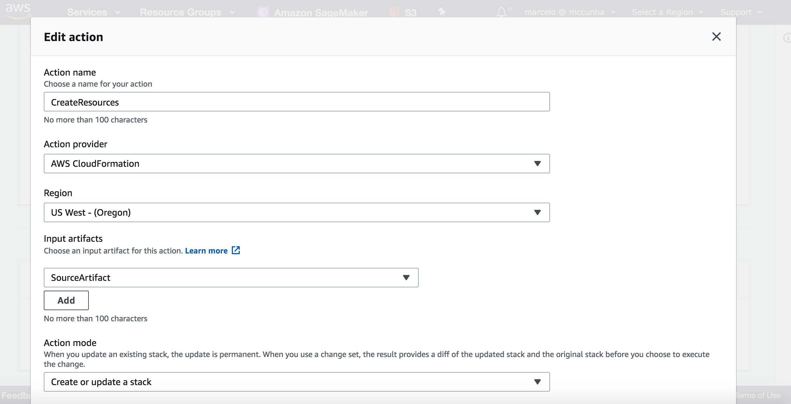
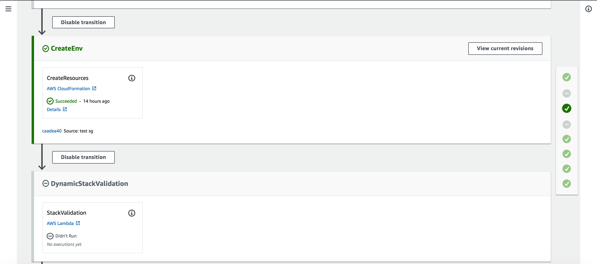

## Lab 4 - Infrastructure as a Code and DevSecOps:

### Stage 1: IaaC
We want to control our infrastrucure in order to enforce security policies. 

1. Let’s make the resources in the Lab become code!

```console
~/environment/WebAppRepo (master) $ cp aws-devops-essential/templates/02-aws-devops-workshop-environment-setup.template ./WebAppRepo/
```

2. Take a few minutes to review in the Cloud9 IDE the template we just copied. Check out some CloudFormation intrinsic functions and features (Mappings, Fn::Join, Ref, etc).

3. Let’s push this template to our CodeCommit Repo:

```console
~/environment/WebAppRepo (master) $ git add 02-aws-devops-workshop-environment-setup.template
~/environment/WebAppRepo (master) $ git commit -m "Added cf"
~/environment/WebAppRepo (master) $ git push origin master
```

4. Create the following stage in our CodePipeline to deploy the infrastructure (VPC, EC2, Security Groups, etc.). Click on "Edit" button on the top right in the CodePipeline console:

5. __Add a new stage to Pipeline after Source and before Build__ (if not specified leave as blank/default):

- __Stage Name__: `CreateEnv`

- Click on __"Add action group"__

- __Action provider__: `AWS CloudFormation`

- __Action name__: `CreateResources`

- __Input Artifact__: `SourceArtifact`

- __Action mode__: `Create or update a stack`

- __Stack name (select the stack that was created before)__: `DevopsWorkshop-Env`

- __Template__: ```SourceArtifact::02-aws-devops-workshop-environment-setup.template```

- __Capabilities__: `CAPABILITY_IAM`

- __Role name__: select the one that contains `CFNRole` that was created before

- __Output__: `CfOutput`

The configurations should be:




6. Save the changes and on the top right click on the “Release” button to check if the Infrastructure is being deployed as code:


***

### Stage 2: Let’s put a little Sec into our DevOps pipeline:

1. We will enforce a security rule that there must not exist security groups allowing open SSH port to the internet.


The following actions are going to be performed in the stages of our Pipeline:
1. __Source stage__: In this example, the pipeline gets the CloudFormation template from the CodeCommit repository that creates the VPC with NACL, IGW, security groups and EC2 instances.

2. __StaticCodeAnalysis stage__: This stage passes the CloudFormation template and pipeline name to a Lambda function, CFNValidateLambda. This function performs the static code analysis. It uses the regular expression language to find patterns and identify security group policy violations. If it finds violations, then Lambda fails the pipeline and includes the violation details.
Here is the regular expression that Lambda function using for static code analysis of the open SSH port:

```console
"^.*Ingress.*(([fF]rom[pP]ort|[tT]o[pP]ort).\s*:\s*u?.(22).*[cC]idr[iI]p.\s*:\s*u?.((0\.){3}0\/0)|[cC]idr[iI]p.\s*:\s*u?.((0\.){3}0\/0).*([fF]rom[pP]ort|[tT]o[pP]ort).\s*:\s*u?.(22))"
```

2. __CreateEnv stage__: After the static code analysis is completed successfully, the pipeline creates the stack resources with the CloudFormation template.

3. __DynamicStackValidation stage__: This step triggers the StackValidationLambda Lambda function. It passes the stack name and pipeline name in the event parameters. Lambda validates the security group deployed for the following security controls. If it finds violations, then Lambda deletes the stack, stops the pipeline, and returns an error message.

The following is the sample Python code used by AWS Lambda to check if the SSH port is open to the approved IP CIDR range (in this example, 72.21.196.67/32):
```python
for n in regions:
    client = boto3.client('ec2', region_name=n)
    response = client.describe_security_groups(
        Filters=[{'Name': 'tag:aws:cloudformation:stack-name', 'Values': [stackName]}])
    for m in response['SecurityGroups']:
        if "72.21.196.67/32" not in str(m['IpPermissions']):
            for o in m['IpPermissions']:
                try:
                    if int(o['FromPort']) <= 22 <= int(o['ToPort']):
                        result = False
                        failReason = "Found Security Group with port 22 open to the wrong source IP range"
                        offenders.append(str(m['GroupId']))
                except:
                    if str(o['IpProtocol']) == "-1":
                        result = False
                        failReason = "Found Security Group with port 22 open to the wrong source IP range"
                        offenders.append(str(n) + " : " + str(m['GroupId']))
```

The next stages remain the same, building, deploying the code to dev and prod environments (with a manual approval action).

***

### Stage 3: Deploy the resources:
1. Create a S3 bucket and upload the zip file for our Lambda functions:
```console
~/environment/WebAppRepo (master) $ aws s3 mb s3://<<YOUR-INITIALS>>-<<REPLACE-YOUR-ACCOUNT-ID>>-<<REPLACE-YOUR-REGION-ID>>
~/environment/WebAppRepo (master) $ aws s3 cp ../aws-devops-essential/sample-app/cfn_validate_lambda.py.zip s3://<<YOUR-INITIALS>>-<<REPLACE-YOUR-ACCOUNT-ID>>-<<REPLACE-YOUR-REGION-ID>>
~/environment/WebAppRepo (master) $ aws s3 cp ../aws-devops-essential/sample-app/stack_validate_lambda.py.zip s3://<<YOUR-INITIALS>>-<<REPLACE-YOUR-ACCOUNT-ID>>-<<REPLACE-YOUR-REGION-ID>>
```

2. Create the resources for our DevSecOps stages in the pipeline:
```console
~/environment/WebAppRepo (master) $ aws cloudformation create-stack --stack-name lab4-resources --template-body file://../aws-devops-essential/templates/lab4-resources.json --capabilities CAPABILITY_IAM --parameters ParameterKey=S3Bucket,ParameterValue=<<YOUR-INITIALS>>-<<REPLACE-YOUR-ACCOUNT-ID>>-<<REPLACE-YOUR-REGION-ID>> --region <<REPLACE-YOUR-REGION-ID>>
```

After the template deployment is complete, go to the console of your CodePipeline pipeline.

3. Add the following stages and actions in the pipeline (click on "Edit" button on the upper right):

    a. __Add stage to Pipeline after Source and before CreateEnv__

    - __Stage Name__: `StaticCodeAnalysis`

    - Click on __"Add action group"__

    - __Action name__: `CFNParsing`

    - __Action provider__: `AWS Lambda`

    - __Input artifacts__: `SourceArtifact`

    - __Function Name__: select function that starts with `lab4-resources-CFNValidateLambda-...`

    - __User parameters - optional__: in the output key-value put the S3 bucket created before in this stage step 1.`{"input": "SourceArtifact", "file": "02-aws-devops-workshop-environment-setup.template","output": "<<YOUR-INITIALS>>-<<REPLACE-YOUR-ACCOUNT-ID>>-<<REPLACE-YOUR-REGION-ID>>"}`

        This Bucket will store the analysis of the template. The Lambda function will analyze the template and tag it, with "valid" or "flagged" depending on the risk score.

    - __Output artifacts__: `SourceArtifact2`

    b. __Add stage to Pipeline after CreateEnv and before Build__

    - __Stage Name__: `DynamicStackValidation`

    - Click on __"Add action group"__

    - __Action name__: `StackValidation`

    - __Action provider__: `AWS Lambda`

    - __Input artifacts__: `SourceArtifact`

    - __Function Name__: select function that starts with `lab4-resources-TestStackValidationLambda-...`

    - __User parameters - optional__: `DevopsWorkshop-Env`

    - __Output artifacts__: leave blank

4. Save the changes. The result should be:





4. Click on the “Release” button again (upper right) to check the security validations.

5. See that our pipeline has failed. Click on “Details” under the action “StaticCodeAnalysis” of the “CFNParsing” stage.


6. Click on “Link to execution details”.


7. The CloudWatch logs associated to our Lambda function will be opened. Select the newest Log Stream:


8. Go to the bottom of the log:


We can see that the rules __“IngressOpenToWorld__” and __“SSHOpenToWorld”__ matched, causing the pipeline to fail and the risk value associated.

9. Open the Lambda functions created, `lab4-resources-CFNValidateLambda-...` and `TestStackValidationLambda-...`. Take a moment to see the security validation logic. Note that the first Lambda function checks DynamoDB for the security rules.

10. Go to the DynamoDB console and check the “DDBRules”. See how rules, categories and risk values could be used to determine when to deploy to next stage or not. Security team could specify rules once and the automation would take care of the rest.


__Fix the security issues__:

11. Go to the Cloud9 IDE and open the `02-aws-devops-workshop-environment-setup.template` file. Check the line 262:


12. Delete this line, delete __the comma the line before__ and __save it (ctrl+s)__:


13. Push the fixed file to the CodeCommit Repository:

```console
~/environment/WebAppRepo (master) $ git add 02-aws-devops-workshop-environment-setup.template
~/environment/WebAppRepo (master) $ git commit -m "Fixed security issue in CF template"
~/environment/WebAppRepo (master) $ git push origin master
```

14. Now a new execution should be triggered by the push to CodeCommit repository. All stages should be executed successfully:


### Stage 4: Congratulations, you have finished the workshop!
You have learned how to create your own __secure__, CI/CD pipeline with AWS tools like CodePipeline, CodeCommit, CodeBuild, CodeDeploy, CloudFormation, Lambda.

[Check the this AWS blog post for more details on DevSecOps](https://aws.amazon.com/blogs/devops/implementing-devsecops-using-aws-codepipeline/).


### ***Stage extra (optional)***:
Check the following repository:
https://github.com/stelligent/pipeline-dashboard

This solution developed by Stelligent shows how we could evaluate our pipeline metrics (MTTR, Lead Time, MTBF, etc.) and use this data to evolve our DevOps organization.


### Cleanup:

You can now proceed to cleanup all the resources

[Cleanup](README.md#clean-up)